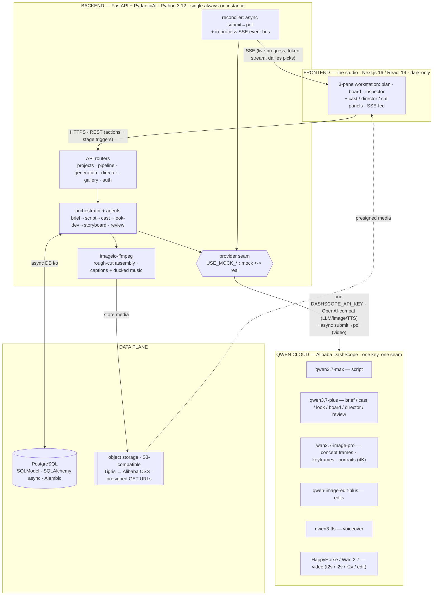

# extrovid — hackathon submission kit

Everything you need to paste into the submission form: tagline, the "About the project"
story, the architecture diagram, a 3-minute demo script, and the launch post.

> Voice note: everything here is in extrovid's house voice — calm, specific, sentence case,
> film-set vocabulary, no marketing fluff. Swap `[link]` for your live URL before posting.

---

## 1 · Tagline

**Recommended**

> one line in, a finished film out.

**Alternatives**

- from a single line to a finished cut.
- one prompt. one director. one finished short.
- write the line. we'll print it.
- your idea — directed, cast, and edited from one prompt.

---

## 2 · About the project

# extrovid

extrovid is an AI-native director and editor. You give it a one-line idea; it writes the brief
and script, casts a consistent cast, develops a look, boards the shots, generates and reviews the
video, adds voiceover, and hands you a rough cut. One prompt to a finished short, with a director
you can talk to at every step.

## Inspiration

Generative models can make a shot. They can't make a film. The gap is everything a director and
editor do between the idea and the cut: holding a character's face steady across scenes, keeping
the light consistent, picking the take that works, trimming to a rhythm. We wanted a tool that
owned that creative and quality-control work, not just the raw generation. The human supplies the
idea and presses a few start buttons. The machine directs.

## What it does

You write a prompt. The director can ask up to four clarifying questions first. Then it runs a
per-stage pipeline — brief, script, cast, look development, storyboard — where each stage stops
until you trigger the next. Cast becomes portraits, look-dev becomes concept images, the
storyboard becomes keyframes. Shots are generated best-of-N, and an AI dailies pass reviews the
takes and prints the winner. Voiceover is synthesized, and ffmpeg assembles the rough cut:
burned-in captions, ducked music, voiceover on top. Publish to a public gallery when it's a take.
Revise, retry, reorder, trim, and recast are always there as optional levers, through the panels
or the Director chat.

## How we built it

The backend is FastAPI with PydanticAI agents over an async SQLModel/PostgreSQL stack, Alembic
migrations, media in S3-compatible storage served by presigned URLs, and a bundled ffmpeg for the
cut. The frontend is Next.js and React: a three-pane workstation fed by one SSE stream.

Every model call runs on Qwen Cloud / Alibaba DashScope, through a single provider seam:

- **Script** — qwen3.7-max
- **Every other agent** (brief, cast, look-dev, storyboard, clarify, revise, director, import, review) — qwen3.7-plus
- **Images** (concept frames, keyframes, portraits) — wan2.7-image-pro
- **Image edits** — qwen-image-edit-plus
- **Voiceover** — qwen3-tts
- **Video** (t2v / i2v / r2v / edit) — HappyHorse or Wan 2.7, both on the same DashScope async submit-then-poll transport

Because every provider sits behind that seam, a `USE_MOCK_*` flag swaps each one for a
deterministic offline mock. The entire pipeline runs locally, with no keys and no cost — which is
how ~236 backend tests run fully offline.

The differentiators live in the machinery: best-of-N generation with the dailies review
auto-selecting the winning take; keyframe-first continuity chaining, where each shot inherits the
previous frame to hold character and look; the Director chat for natural-language revision at any
step. Long video jobs are async — submit, then poll — reconciled by a background in-process loop,
with live progress streamed to the UI over an SSE pub/sub bus. Hidden work surfaces as agent-trace
chips: "checking continuity... picked best of 3."

## Challenges we ran into

- **Long-running video jobs.** The reconciler runs in-process with no leader election, so it's
  pinned to a single instance — and DashScope result URLs expire in 24 hours, so we persist media
  before they go stale.
- **SSE through proxies.** Buffering swallowed our live progress until we tuned headers and
  flushing so events actually reach the browser.
- **Qwen3 thinking mode.** It rejects `tool_choice=required`, which we leaned on for structured
  output, so we reworked how we coax agents into schema-clean responses.
- **Continuity across independently generated shots.** Each shot is its own generation; holding a
  face and a look steady took keyframe chaining, not hoping the models agreed.
- **Cost control.** Per-user daily caps plus the mock seam keep spend bounded and development free.

## Accomplishments we're proud of

A full idea-to-cut pipeline that runs unattended, end to end, on Qwen Cloud. A best-of-N and
dailies loop that makes an editorial decision, not just pixels. And a codebase that runs entirely
offline: deterministic, testable, demoable without a key.

## What we learned

Async video is the hard part, not the prompts. Continuity is an architecture problem, not a prompt
problem. And a clean provider seam is worth building first — it gave us offline tests, cost safety,
and a real cloud path from the same code.

## What's next

Migration to Alibaba Cloud (ECS, RDS PostgreSQL, OSS). A reconciler that survives multiple
instances. More director controls — pacing, transitions, music. Longer edits. And more ways to say
"print it."

---

## 3 · Architecture diagram

A rendered, on-brand version lives in [`docs/architecture.html`](architecture.html) — open it in a
browser and screenshot it for the submission (it uses extrovid's golden-hour palette: **amber =
human intent, slate-cyan = the machine working**).

The Mermaid source below is for platforms that render diagrams inline. It shows how **Qwen Cloud
connects to the frontend, backend, and data plane**, all through one provider seam.

**Read it in one breath:** you write a line in the **studio** (frontend). The **backend** plans it
with agents, assembles the cut with ffmpeg, and reaches **Qwen Cloud** for every model call through
**one seam** — flip `USE_MOCK_*` and the same code runs fully offline. Metadata lives in
**PostgreSQL**; generated media lives in **object storage** and streams back to the browser via
presigned URLs; progress streams live over **SSE**.

---

## 4 · Demo video script (3 minutes)

**Format:** screen-recording walkthrough of the live product, with voiceover narration.
**Every model call runs on Alibaba Cloud DashScope / Qwen.**

| TIME | ON SCREEN | VOICEOVER |
|------|-----------|-----------|
| **0:00–0:18** | Cold open. The landing page fades up: dark "director's studio at golden hour," lowercase serif wordmark **extro**_vid_. Slow push toward the composer. A one-line prompt sits waiting in the field. | "This is extrovid. You give it one line. It gives back a finished, edited short — it writes the brief and script, casts the characters, develops the look, boards the shots, renders them, adds voiceover, and cuts it together. Every model it calls runs on Qwen, on Alibaba Cloud DashScope." |
| **0:18–0:38** | Sign in with Google, one tap. Land on the workstation — three panes: plan, board, inspector. Click **new project**. In the composer, type live: *"A lighthouse keeper who befriends a storm. Warm, hopeful, 30 seconds."* Hit the amber **start** button. | "Sign in, create a project, write the idea in plain language. That's the only creative input it needs. Amber is your intent. Slate-cyan is the machine working. Press start, and the director takes it from here." |
| **0:38–1:05** | Planning streams in as one call. Agent-trace step rows appear top to bottom: *directing… briefing… writing script… casting… developing the look… boarding.* Text lands **token by token** — the brief writes itself, then the script, scene by scene. | "Planning runs as one call and streams straight back. Every row is an agent, and every agent is a Qwen Cloud model. The brief, cast, look, and board run on qwen3.7-plus. The script — the flagship — runs on qwen3.7-max. You're watching it think, token by token. No spinner." |
| **1:05–1:30** | Image generation. Cast panel fills with **character portraits**. Look-dev shows **concept frames** — golden light, storm-grey sea. Storyboard populates with **keyframes**, one per shot. Hover a keyframe: a chip reads *"chained from previous frame for continuity."* | "Now it draws. Cast portraits, look-development concept frames, and a storyboard keyframe for every shot — all from wan2.7-image-pro, up to 4K. Keyframes chain forward, so the keeper's face and the film's look hold from shot to shot." |
| **1:30–2:00** | Trigger video. Shot cards flip to rendering. **SSE progress bars** move live; a queue shows shots lined up. The **pre-spend cost meter** reads before spend. A trace chip animates: *"rendering take 1 of 3… checking continuity… picked best of 3."* The winning take snaps in. | "Press generate. Shots render through HappyHorse — number one on the Artificial Analysis video arena — also on DashScope. It renders best-of-N, then an AI dailies review watches every take and picks the winner. 'Picked best of three.' Progress streams live over SSE, and the cost is shown before it spends anything." |
| **2:00–2:22** | Voiceover + assembly. A **qwen3-tts** voiceover track appears under the timeline. Rough-cut assembly runs: **burned-in captions**, **background music ducking** under the narration. The finished short plays inline — lighthouse, storm, warm resolve. | "Voiceover is qwen3-tts. Then ffmpeg assembles the rough cut — captions burned in, music ducked under the voice. And there's the short. One line of text, a few minutes ago." |
| **2:22–2:42** | Open **Director chat**. Type: *"make shot 3 warmer."* The director replies in sentence case, re-renders only shot 3, and the warmer take drops into the timeline. Play the updated cut. | "Every step is a conversation. Tell the director 'make shot three warmer' — it re-renders just that shot and slots it back in. Revise, retry, recast, reorder — optional levers, in plain language, at any step." |
| **2:42–3:00** | Click **publish**. The short lands in the public gallery. Cut back to the finished frame. Overlay, quiet: *every model on Qwen Cloud · runs fully offline via the mock seam.* End on the wordmark. VO ends on the payoff line. | "Publish to the gallery, and it's done. Every model — script, cast, look, image, video, voice — runs on Qwen, on Alibaba Cloud. The whole pipeline also runs offline through a mock seam: deterministic, cost-safe, fully testable. One line to a finished cut. That's a take. Print it." |

### Production notes

- **Pre-generate everything.** Record against a project that has already completed a full run end
  to end. Real video renders take minutes and will stall a 3-minute demo. Have the finished short,
  all takes, portraits, keyframes, and the published gallery entry ready. You're replaying a real
  run, not gambling on a live one.
- **Fake the wait, keep it honest.** For planning and video, capture the *real* token-streaming and
  SSE progress once, then edit so it lands inside the time blocks. Never mock the UI — every screen
  shown must be the actual product.
- **The one thing to run live (optional):** the Director chat "make shot 3 warmer" revision reads
  best if it's genuinely quick. If it can't complete in ~10s, pre-bake the warmer take and scrub to it.
- **Lead with the differentiators on screen, not just in VO.** Linger ~1s on each trace chip:
  "picked best of 3," "chained for continuity," and the pre-spend cost meter. Judges scanning for
  the clever bits should catch them visually.
- **Say "Qwen Cloud / DashScope" at least three times** — cold open, planning, video. Name the
  specific model ids on screen where they appear: qwen3.7-max on the script row, qwen3.7-plus on the
  other planning agents, wan2.7-image-pro on keyframes, HappyHorse on shots, qwen3-tts on the VO
  track. A lower-third or inspector label works.
- **Capture at 1920×1080, 60fps**, dark theme only (the product is dark-only by design). Export at
  a high bitrate so the golden-hour gradients and small trace-chip text stay crisp.
- **Pacing:** narration sits around 150 words/min — roughly the counts above. Leave ~1s of silence
  at each stage hand-off so the payoff lands. Don't rush the final frame; let "Print it." breathe.
- **Tone:** calm, specific, sentence case, never hyped. Film-set vocabulary throughout — brief,
  cast, look, board, take, dailies, rough cut, print it. A director talking quietly on a calm set,
  not an ad.
- **Music:** one warm, restrained bed at golden-hour temperature; ducked hard under every line of
  VO so the words always win.

---

## 5 · Twitter / X launch post

**Recommended (~275 chars)**

> introducing extrovid — an AI-native director and editor. give it one line, get a finished,
> edited short: brief, script, cast, look, storyboard, shots, voiceover, rough cut. every model —
> script, image, voice, video — runs on Qwen Cloud / DashScope. try it: [link]
> #QwenCloud #AlibabaCloud #AIvideo

**2-tweet thread**

**1/**
> meet extrovid: an AI-native director and editor. you write one line — it writes the brief and
> script, casts the leads, develops the look, boards the shots, renders each one best of N, picks
> the winning take, adds voiceover, and prints a rough cut.

**2/**
> the whole pipeline runs on Qwen Cloud / DashScope end to end — qwen3.7-max for script,
> wan2.7-image-pro for frames, qwen3-tts for voice, HappyHorse for video. talk to the director,
> revise in plain language, publish when it's a take.
>
> try it: [link] #QwenCloud #AlibabaCloud #AIvideo
